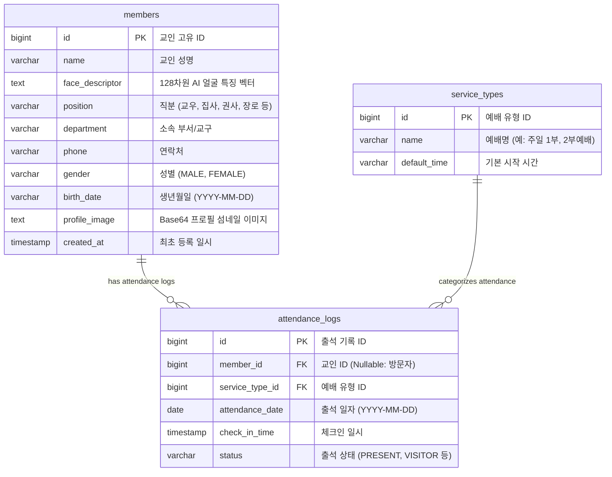

# 📐 Cmm 프로젝트 엔티티 & 데이터베이스 테이블 정의서

본 문서는 교회 AI 무인 출석 관리 시스템(Cmm)에서 사용하는 데이터베이스 테이블 구조와 JPA 엔티티(Entity) 매핑 명세를 정리한 엔티티 정의서입니다.

---

## 🗺️ Entity Relationship Diagram (ERD)



---

## 📑 1. `members` (교인 정보 테이블)

- **Entity Class**: `com.example.cmm.entity.Member`
- **설명**: 교인의 인적사항, 직분, 소속 부서, 프로필 섬네일 이미지 및 AI 128차원 얼굴 벡터 데이터를 관리하는 마스터 테이블입니다.

| 컬럼명 (Physical Column) | 데이터 타입 (Data Type) | JPA 필드명 (Field Name) | Null 여부 | 제약조건 (Key) | 설명 (Description) |
| :--- | :--- | :--- | :--- | :--- | :--- |
| `id` | `BIGINT` | `Long id` | **NOT NULL** | **PK (Auto Increment)** | 교인 고유 식별자 |
| `name` | `VARCHAR(255)` | `String name` | **NOT NULL** | - | 교인 성명 (동명이인 허용) |
| `face_descriptor` | `TEXT` | `String faceDescriptor` | **NOT NULL** | - | face-api.js 128차원 얼굴 특징 수치 벡터 (JSON) |
| `position` | `VARCHAR(30)` | `String position` | NULL | - | 직분 (교우, 집사, 권사, 장로, 목사, 전도사, 기타 수기) |
| `department` | `VARCHAR(50)` | `String department` | NULL | - | 소속 부서/교구 (예: 청년부, 1교구) |
| `phone` | `VARCHAR(20)` | `String phone` | NULL | - | 연락처 (예: 010-1234-5678) |
| `gender` | `VARCHAR(10)` | `String gender` | NULL | - | 성별 (MALE, FEMALE) |
| `birth_date` | `VARCHAR(10)` | `String birthDate` | NULL | - | 생년월일 (YYYY-MM-DD) |
| `profile_image` | `TEXT` | `String profileImage` | NULL | - | Base64 데이터 URL 형식 프로필 섬네일 이미지 |
| `created_at` | `TIMESTAMP` | `LocalDateTime createdAt` | **NOT NULL** | Updatable=False | 최초 등록 일시 |

---

## 📑 2. `attendance_logs` (출석 이력 테이블)

- **Entity Class**: `com.example.cmm.entity.Attendance`
- **설명**: 카메라인식을 통한 무인 출석 체크 시 기록되는 출석 이력 테이블입니다. 등록 교인뿐만 아니라 미등록 방문자/새가족 출석도 함께 기록됩니다.

| 컬럼명 (Physical Column) | 데이터 타입 (Data Type) | JPA 필드명 (Field Name) | Null 여부 | 제약조건 (Key) | 연관 관계 | 설명 (Description) |
| :--- | :--- | :--- | :--- | :--- | :--- | :--- |
| `id` | `BIGINT` | `Long id` | **NOT NULL** | **PK (Auto Increment)** | - | 출석 로그 고유 ID |
| `member_id` | `BIGINT` | `Member member` | NULL | **FK (`members.id`)** | ManyToOne (Fetch=LAZY) | 출석 교인 ID (NULL일 경우 새가족/방문자) |
| `service_type_id` | `BIGINT` | `ServiceType serviceType` | NULL | **FK (`service_types.id`)** | ManyToOne (Fetch=LAZY) | 예배/집회 유형 ID |
| `attendance_date` | `DATE` | `LocalDate attendanceDate` | **NOT NULL** | - | - | 출석 일자 (YYYY-MM-DD) |
| `check_in_time` | `TIMESTAMP` | `LocalDateTime checkInTime` | **NOT NULL** | - | - | 인식 체크인 일시 |
| `status` | `VARCHAR(20)` | `String status` | NULL | - | - | 출석 상태 (`PRESENT`: 출석 완료, `VISITOR`: 새가족/방문자) |

---

## 📑 3. `service_types` (예배 유형 마스터 테이블)

- **Entity Class**: `com.example.cmm.entity.ServiceType`
- **설명**: 주일 1부예배, 2부예배, 청년부예배, 수요예배 등 예배 종류 마스터 정보를 관리합니다.

| 컬럼명 (Physical Column) | 데이터 타입 (Data Type) | JPA 필드명 (Field Name) | Null 여부 | 제약조건 (Key) | 설명 (Description) |
| :--- | :--- | :--- | :--- | :--- | :--- |
| `id` | `BIGINT` | `Long id` | **NOT NULL** | **PK (Auto Increment)** | 예배 유형 고유 ID |
| `name` | `VARCHAR(50)` | `String name` | **NOT NULL** | - | 예배명 (예: 주일 1부예배, 수요예배) |
| `default_time` | `VARCHAR(10)` | `String defaultTime` | NULL | - | 기본 예배 시작 시각 (예: 09:00, 11:00) |

---

## 🛠️ DDL 스크립트 (Database Creation SQL)

```sql
-- 1. 교인 테이블 (members)
CREATE TABLE IF NOT EXISTS members (
    id BIGSERIAL PRIMARY KEY,
    name VARCHAR(255) NOT NULL,
    face_descriptor TEXT NOT NULL,
    position VARCHAR(30),
    department VARCHAR(50),
    phone VARCHAR(20),
    gender VARCHAR(10),
    birth_date VARCHAR(10),
    profile_image TEXT,
    created_at TIMESTAMP NOT NULL DEFAULT CURRENT_TIMESTAMP
);

-- 2. 예배 유형 테이블 (service_types)
CREATE TABLE IF NOT EXISTS service_types (
    id BIGSERIAL PRIMARY KEY,
    name VARCHAR(50) NOT NULL,
    default_time VARCHAR(10)
);

-- 3. 출석 이력 로그 테이블 (attendance_logs)
CREATE TABLE IF NOT EXISTS attendance_logs (
    id BIGSERIAL PRIMARY KEY,
    member_id BIGINT REFERENCES members(id) ON DELETE CASCADE,
    service_type_id BIGINT REFERENCES service_types(id) ON DELETE SET NULL,
    attendance_date DATE NOT NULL,
    check_in_time TIMESTAMP NOT NULL,
    status VARCHAR(20) DEFAULT 'PRESENT'
);

-- 인덱스 생성 (속도 최적화)
CREATE INDEX IF NOT EXISTS idx_attendance_date ON attendance_logs(attendance_date);
CREATE INDEX IF NOT EXISTS idx_attendance_member_date ON attendance_logs(member_id, attendance_date);
```
